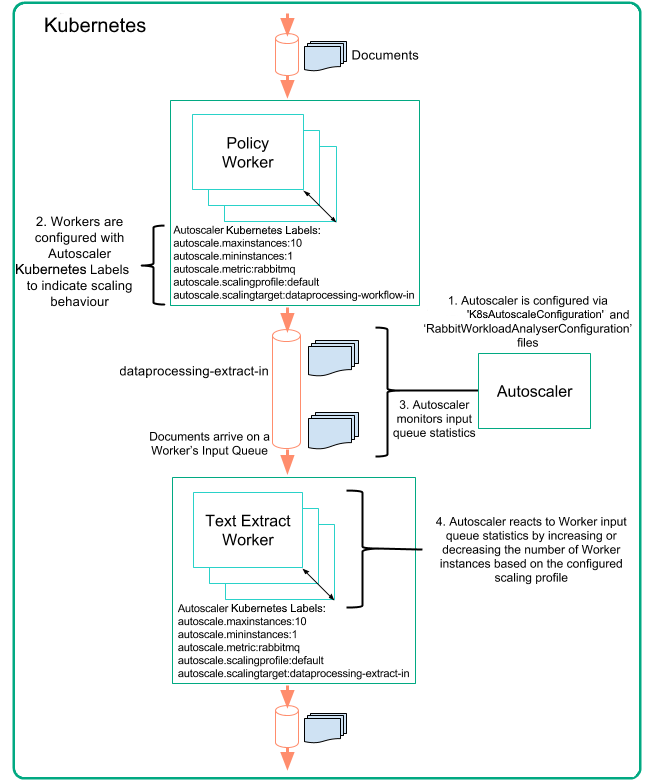

# Architecture

The Autoscaler service monitors Kubernetes microservice message throughput statistics and scales microservice instances up or down according to their configuration. By scaling microservices according to their demand, the Autoscaler enables efficient system resource allocation. The following high-level architecture description explains the relationship of the Autoscaler and its components.

## Overview

The figure below illustrates the Worker scaling functionality of the Autoscaler.



The pipes represent asynchronous message queues on RabbitMQ.

1. Autoscaler is configured via configuration files:
 - `K8sAutoscaleConfiguration` contains configuration options for the Kubernetes endpoint and maximum number of overall microservice instances.
 - `RabbitWorkloadAnalyserConfiguration` contains configuration options for the RabbitMQ Management endpoint, RabbitMQ Management user details and Autoscaler Rabbit Workload Scaling Profiles.
2. Workers (microservices) are configured with Kubernetes Labels for Autoscaler use.
3. Autoscaler monitors Workers' RabbitMQ input queue's load processing statistics.
4. Autoscaler increases or decreases the number of Worker instances for an input queue based on input queue statistics and the scaling profile set for the Worker.

### Framework

The `autoscale-core` is built on an extensible framework that can be used to build different Worker Autoscalers.  The Worker Autoscaler is packaged with plugins for RabbitMQ and Marathon but due to the extensible nature of the framework, additional plugins can be written for alternative queuing and container orchestration tools.


### Configuration

If you are running on the Kubernetes platform, no environment variables are required to be set to start the Autoscale Application. If you are not running on the Kubernetes platform, you will need to set `CAF_APPNAME` to an appropriate value to specify the namespace/grouping for the particular autoscaler instance.  

The following configuration can (optionally) be set in the .yaml file:
* sourceRefreshPeriod (integer), the time in seconds between refreshing the available services to autoscale, defaults to 900
* executorThreads (integer), the number of simultaneous execution threads in the scheduled thread pool, defaults to 5

### Starting the application

The following command-line should start the application:
 
```
java -cp "*" com.github.autoscaler.core.AutoscaleApplication server [yaml]
```
 
### The ServiceSource component

The following classes and interfaces are relevant to the `ServiceSource` component:
 
* ServiceSource: abstract class that acts as a base implementation
* ServiceSourceProvider: interface for acquiring a ServiceSource
* ScalingConfiguration: returned by a ServiceSource to the application
    
An implementation of `ServiceSource` acquires service information and produces a set of `ScalingConfiguration` objects which are passed back to the application which will then be validated and if so, monitored and autoscaled. The component will be asked periodically for the latest set of services.

### The ServiceScaler component

The following classes and interfaces are relevant to the `ServiceSscaler` component:
 
* ServiceScaler: abstract class that acts as a base implementation
* ServiceScalerProvider: interface for acquiring a ServiceScaler
* InstanceInfo: container for information about the running instances of a service
* ServiceHost: container for information about the host of a specific service instance
    
An implementation of `ServiceScaler` should be able to report the current number of running instances of a service (and where they are) and also trigger the scaling up or down of the service. The `ServiceScaler` is not required to enforce the minimum/maximum instances that a service requests. The application itself will perform these checks.

### The WorkloadAnalyser component

The following classes and interfaces are relevant to the `WorkloadAnalyser` component:
 
* WorkloadAnalyser: abstract class that acts as a base implementation for performing analysis
* WorkloadAnalyserFactory: abstract class for acquiring a WorkloadAnalyser for a given service
* WorkloadAnalyserFactoryProvider: interface for acquiring a WorkloadAnalyserFactory
* ScalingAction: represents a recommendation on scaling from a WorkloadAnalyser to the application
* ScalingOperation: enumeration indicating whether to scale up, down, or not at all
    
A `WorkloadAnalyser` performs analysis for a specific service, which will be instantiated by a `WorkloadAnalyserFactory`. This factory itself is acquired by a `WorkloadAnalyserFactoryProvider`, which also must provide a unique key to the application which is used to identify this sort of `WorkloadAnalyser`. Services will request their method of workload analysis be performed by specifying this key. The `analyseWorkload(InstanceInfo)` method of the `WorkloadAnalyser` will be called periodically by a `ScalerThread` which is scheduled by `autoscale-core`.

### The ScalingConfiguration object

A service needs to specify various information about how it wants its workload to be analyzed, its scaling profile, and minimum and maximum instances. The `ServiceSource` component is responsible for returning a collection of these objects back to the Autoscale Application. The `ScalingConfiguration` class has various validation annotations to ensure a specific instance of the class can be used. The important parts that should be filled in by `ServiceSource` are:
 
* id: the id, reference, or name of the service. Must not be null or empty
* appOwner: name of the owning application of the service. Must not be null or empty
* interval: period in seconds between performing analysis runs on this service. Minimum is 1
* minInstances: minimum number of instances for this service. Minimum is 0
* maxInstances: maximum number of instances for this service. Minimum is 1
* workloadMetric: name (key) of the WorkloadAnalyser that should perform analysis for this service. Must not be null or empty
* scalingTarget: implementation specific value that refers to the target that must be monitored for scaling purposes. Typically with queue-based metrics, this will be the name of the queue. This can be null.
* scalingProfile: name of the profile to use which may be relevant to the specific WorkloadAnalyser implementation This can be null
* backoff: the number of workload analysis runs that will be skipped after the analyzer triggers a scaling operation. This can help avoid unusual scaling behavior while the system is in-between states
    
There are additional scenarios which may mean a service may be ignored by an instance of the Autoscale Application which are outside basic validation. These are the cases where the application owner of the Autoscale instance does not match the appOwner specified in the `ScalingConfiguration` and the case where the workload metric specified is not available to that instance of the Autoscale Application.
