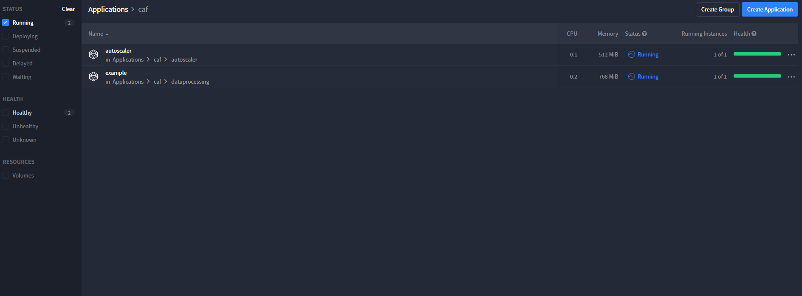
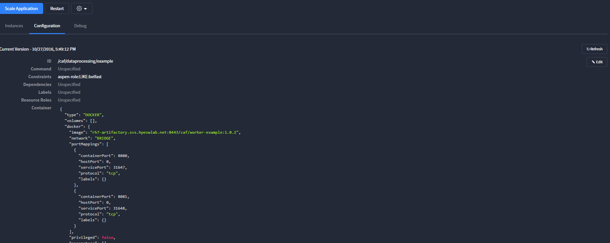
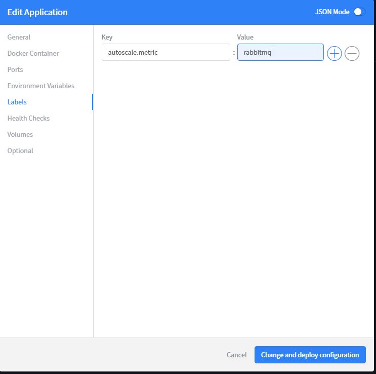
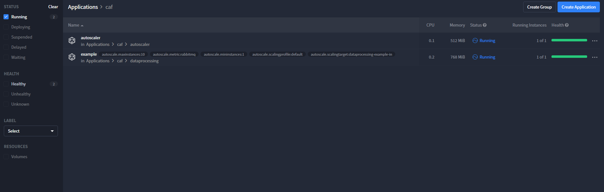
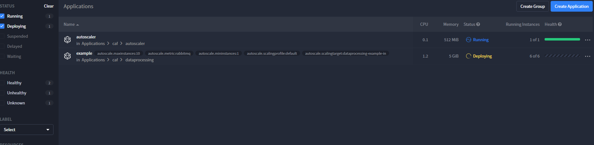
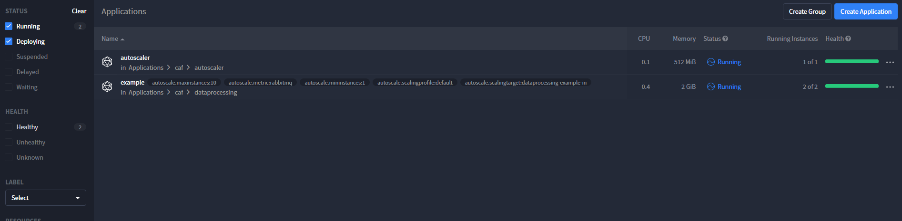

# Getting Started

The Autoscaler's extensibile design facilitates integration with orchestration technologies such as Marathon, Docker Stack and Kubernetes. Out of the box the we provide an Autoscaler container for use with Marathon and RabbitMQ. When deployed this application monitors RabbitMQ queues and scales Marathon applications consuming from the queues.

## Deploying the Autoscaler on Marathon

1. Download and extract the Marathon [deployment files](https://github.com/Autoscaler/autoscaler/archive/develop.zip)
2. Open `marathon-files/cfg_demo_service_autoscaler_MarathonAutoscaleConfiguration`
3. Set `endpoint` to the host and port for your Marathon installation.
4. Open `marathon-files/cfg_demo_service_autoscaler_RabbitWorkloadAnalyserConfiguration`
5. Set `rabbitManagementEndpoint` to the host and port of your RabbitMQ Management console
6. Set the `rabbitManagementUser` and `rabbitManagementPassword` to the appropriate values for your RabbitMQ instance
7. Use curl to deploy the application to Marathon
`curl -vX POST http://<marathon-host>:8080/v2/apps -d @marathon-autoscaler.json --header "Content-Type: application/json"`

__Note that the URIs listed in marathon-autoscaler.json must be accessible from the Mesos agent. See [Marathon Application Basics](http://mesosphere.github.io/marathon/docs/application-basics.html#using-resources-in-applications) for more information.__ 

## The Autoscaler in Action

The Autoscaler will increase the number of instances for an associated Marathon application in response to the number of messages waiting to be processed on that application's queue. When the number of messages is reduced, the Autoscaler reduces the number of instances accordingly.

The [MarathonAutoscaleConfiguration](https://github.com/Autoscaler/autoscaler/blob/develop/marathon-files/cfg_demo_service_autoscaler_MarathonAutoscaleConfiguration) file specifies properties relating to the Autoscaler within Marathon. It contains a number of properties:

`endpoint`: The fully qualified URL to the Marathon endpoint including port. Must not be null or empty. <br>
`maximumInstances`: The absolute upper ceiling for a number of service instances. The minimum value is 1. <br>
`groupId`: Comma-separated list of Group IDs in Marathon that the Autoscaler will monitor. All of the services in these groups and subsequent sub-groups will be monitored and autoscaled as necessary.

The [RabbitWorkloadAnalyserConfiguration](https://github.com/Autoscaler/autoscaler/blob/develop/marathon-files/cfg_demo_service_autoscaler_RabbitWorkloadAnalyserConfiguration) file configures a WorkloadAnalyser that uses the RabbitMQ management server to determine the workload of a service using a RabbitMQ queue. It contains the following properties:

`rabbitManagementEndpoint`: A valid URL that is the HTTP endpoint of the RabbitMQ server. <br>
`rabbitManagementUser`: The RabbitMQ management user, which is used for basic HTTP authentication. <br>
`rabbitManagementPassword`: The RabbitMQ management user's password, which is used for basic HTTP authentication. This configuration parameter is assumed to be encrypted (if you are using a Cipher module). <br>
`vhost`: The RabbitMQ vhost that contains the queues. <br>
`profiles`: Map of profile name to RabbitWorkloadProfile objects, which represents different scaling profiles. **Note:** there *must* be a profile named "default".

### Example Worker

For demonstration purposes, the Example-Worker will be used to observe the behaviors of the Autoscaler.

You can view the status of the services on Marathon at the following URL:

`<marathon-endpoint>/ui/#`

The figure shows you the health of the workers and services:



Services deployed by Marathon (such as Example-Worker) contain **labels** in their marathon templates which contain autoscaling metadata. This metadata corresponds to the Autoscaler and affects how it treats the service. These labels are explained in further detail below:

#### Label Definitions

`autoscale.scalingtarget` - The RabbitMQ queue name to monitor <br>
`autoscale.scalingprofile` - Can be an arbitrary string and has a default profile setting that must also be present in [RabbitWorkloadAnalyserConfiguration](https://github.com/Autoscaler/autoscaler/blob/develop/marathon-files/cfg_demo_service_autoscaler_RabbitWorkloadAnalyserConfiguration). <br>
`autoscale.mininstances`: The minimum number of instances a worker can have, set as your level of resources and quality of service dictate<br>
`autoscale.metric`: Dictates the scaling methodology used. This should be set to "rabbitmq". <br>
`autoscale.maxinstances`: The maximum number of instances a worker can have; set as your level of resources and quality of service dictate.<br>
`autoscale.interval`: Measured in seconds. This controls how fervently the autoscaler monitors the service (i.e. how often it re-evaluates the number of services required to service the workload).<br>
`autoscale.backoff`: Manages the number of intervals to skip after a scale up or down command is issued while monitoring. This prevents unusual values being considered when the system is in an unstable state.  <br>
`autoscale.scaledownbackoff`: Optional. Manages the number of intervals to skip after a scale down command is issued while monitoring. This prevents unusual values being considered when the system is in an unstable state. If this is not set it will fall back to `autoscale.backoff`.  <br>
`autoscale.scaleupbackoff`: Optional. Manages the number of intervals to skip after a scale up command is issued while monitoring. This prevents unusual values being considered when the system is in an unstable state. If this is not set it will fall back to `autoscale.backoff`.   


**NOTE:** <br>
You should set **autoscale.interval** to an acceptable value with your given service workload. Setting this property to a **lower than required** value causes the Autoscaler to scale up services at a rapid rate and can cause unstable scaling. The number of instances can then potentially increase and decrease rapidly with no cause. <br>
Setting this property to a **higher than required** value will cause infrequent scaling, meaning that the workers could lag behind the demand.<br>
Containers that rapidly consume messages can have a lower interval. This algorithm may not be suitable for your workloads if your containers consume messages slowly (whereby the average consumption is tens of minutes or hours). You may wish to consider writing a workload module more suited to your needs.

### Adding labels to the service


To add labels to the worker in Marathon: <br>
1. Click on the service you want to add labels. <br>
2. Click on the **Configuration** tab. <br>
3. Click **edit** to the right of the config file that is displayed. A model window will open, allowing you to configure the service. <br>
   <br> <br>
4. Click **labels** in the side bar and add your labels.
   <br> <br>
5. Click **Change and deploy configuration**

Marathon will redeploy the worker with the new labels applied. Notice the new labels also appear on the applications view beside the service name.


<br>
<br>
<br>

### Observing the Autoscaler 

The Autoscaler will always keep one instance of Worker-Example running as the **autoscale.mininstances** set to one, regardless if the target-dataprocessing-example-in queue is empty or not. It will process work as it is brought to the queue.

The log of the Autoscaler below can be seen processing incoming tasks:
<br>

```
DEBUG [2016-10-27 15:19:57,504] com.hpe.caf.autoscale.core.ScalerThread: Workload analysis run for service /caf/dataprocessing/example 
DEBUG [2016-10-27 15:19:57,530] com.hpe.caf.autoscale.workload.rabbit.RabbitWorkloadAnalyser: Stats for target dataprocessing-example-in: QueueStats{messages=0, publishRate=0.0, consumeRate=0.0}
DEBUG [2016-10-27 15:20:07,531] com.hpe.caf.autoscale.core.ScalerThread: Workload analysis run for service /caf/dataprocessing/example
DEBUG [2016-10-27 15:20:07,556] com.hpe.caf.autoscale.workload.rabbit.RabbitWorkloadAnalyser: Stats for target dataprocessing-example-in: QueueStats{messages=8, publishRate=0.0, consumeRate=0.4}
172.17.0.1 - - [27/Oct/2016:15:20:13 +0000] "GET /healthcheck HTTP/1.1" 200 - "-" "spray-can/1.3.3" 3
DEBUG [2016-10-27 15:20:17,558] com.hpe.caf.autoscale.core.ScalerThread: Workload analysis run for service /caf/dataprocessing/example
DEBUG [2016-10-27 15:20:17,578] com.hpe.caf.autoscale.workload.rabbit.RabbitWorkloadAnalyser: Stats for target dataprocessing-example-in: QueueStats{messages=8, publishRate=0.0, consumeRate=0.0}
DEBUG [2016-10-27 15:20:27,579] com.hpe.caf.autoscale.core.ScalerThread: Workload analysis run for service /caf/dataprocessing/example
DEBUG [2016-10-27 15:20:27,599] com.hpe.caf.autoscale.workload.rabbit.RabbitWorkloadAnalyser: Stats for target dataprocessing-example-in: QueueStats{messages=5, publishRate=0.0, consumeRate=0.0}
DEBUG [2016-10-27 15:20:37,603] com.hpe.caf.autoscale.core.ScalerThread: Workload analysis run for service /caf/dataprocessing/example
DEBUG [2016-10-27 15:20:37,642] com.hpe.caf.autoscale.workload.rabbit.RabbitWorkloadAnalyser: Stats for target dataprocessing-example-in: QueueStats{messages=3, publishRate=0.0, consumeRate=0.0}
DEBUG [2016-10-27 15:20:47,643] com.hpe.caf.autoscale.core.ScalerThread: Workload analysis run for service /caf/dataprocessing/example
DEBUG [2016-10-27 15:20:47,663] com.hpe.caf.autoscale.workload.rabbit.RabbitWorkloadAnalyser: Stats for target dataprocessing-example-in: QueueStats{messages=1, publishRate=0.0, consumeRate=0.4}
DEBUG [2016-10-27 15:20:57,663] com.hpe.caf.autoscale.core.ScalerThread: Workload analysis run for service /caf/dataprocessing/example
DEBUG [2016-10-27 15:20:57,687] com.hpe.caf.autoscale.workload.rabbit.RabbitWorkloadAnalyser: Stats for target dataprocessing-example-in: QueueStats{messages=0, publishRate=0.0, consumeRate=0.0}
```

The number of incoming messages does not exceed the Autoscaler's set limit for when a new instance should be scaled up (determined by the properties scalingDelay and backlogGoal in [RabbitWorkloadAnalyserConfiguration](https://github.com/Autoscaler/autoscaler/blob/develop/marathon-files/cfg_demo_service_autoscaler_RabbitWorkloadAnalyserConfiguration)). The single running instance will finish the work, as shown by the following logs from Example-Worker:
<br>

```
72.17.0.1 - - [27/Oct/2016:15:16:13 +0000] "GET /healthcheck HTTP/1.1" 200 - "-" "spray-can/1.3.3" 4189
172.17.0.1 - - [27/Oct/2016:15:18:13 +0000] "GET /healthcheck HTTP/1.1" 200 - "-" "spray-can/1.3.3" 5160
INFO  [2016-10-27 15:19:53,024] com.hpe.caf.worker.example.ExampleWorker: Starting work
INFO  [2016-10-27 15:20:19,045] com.hpe.caf.worker.example.ExampleWorker: Starting work
172.17.0.1 - - [27/Oct/2016:15:20:13 +0000] "GET /healthcheck HTTP/1.1" 200 - "-" "spray-can/1.3.3" 5262
INFO  [2016-10-27 15:20:21,956] com.hpe.caf.worker.example.ExampleWorker: Starting work
INFO  [2016-10-27 15:20:26,363] com.hpe.caf.worker.example.ExampleWorker: Starting work
INFO  [2016-10-27 15:20:30,223] com.hpe.caf.worker.example.ExampleWorker: Starting work
INFO  [2016-10-27 15:20:33,392] com.hpe.caf.worker.example.ExampleWorker: Starting work
INFO  [2016-10-27 15:20:36,412] com.hpe.caf.worker.example.ExampleWorker: Starting work
INFO  [2016-10-27 15:20:39,822] com.hpe.caf.worker.example.ExampleWorker: Starting work
INFO  [2016-10-27 15:20:43,148] com.hpe.caf.worker.example.ExampleWorker: Starting work
INFO  [2016-10-27 15:20:47,251] com.hpe.caf.worker.example.ExampleWorker: Starting work
172.17.0.1 - - [27/Oct/2016:15:22:13 +0000] "GET /healthcheck HTTP/1.1" 200 - "-" "spray-can/1.3.3" 4825
172.17.0.1 - - [27/Oct/2016:15:24:13 +0000] "GET /healthcheck HTTP/1.1" 200 - "-" "spray-can/1.3.3" 4865
```


When a large amount of work is placed in the queue, the Autoscaler will determine how many new instances are required and scale up accordingly.

The following logs show the Autoscaler detecting the workload and reacting as required:
<br>

```
DEBUG [2016-10-27 15:45:51,456] com.hpe.caf.autoscale.workload.rabbit.RabbitWorkloadAnalyser: Stats for target dataprocessing-example-in: QueueStats{messages=0, publishRate=1.4, consumeRate=0.0}
DEBUG [2016-10-27 15:46:01,457] com.hpe.caf.autoscale.core.ScalerThread: Workload analysis run for service /caf/dataprocessing/example
DEBUG [2016-10-27 15:46:01,486] com.hpe.caf.autoscale.workload.rabbit.RabbitWorkloadAnalyser: Stats for target dataprocessing-example-in: QueueStats{messages=104, publishRate=11.2, consumeRate=0.0}
DEBUG [2016-10-27 15:46:11,487] com.hpe.caf.autoscale.core.ScalerThread: Workload analysis run for service /caf/dataprocessing/example
DEBUG [2016-10-27 15:46:11,531] com.hpe.caf.autoscale.workload.rabbit.RabbitWorkloadAnalyser: Stats for target dataprocessing-example-in: QueueStats{messages=212, publishRate=11.0, consumeRate=0.0}
172.17.0.1 - - [27/Oct/2016:15:46:14 +0000] "GET /healthcheck HTTP/1.1" 200 - "-" "spray-can/1.3.3" 5
DEBUG [2016-10-27 15:46:21,534] com.hpe.caf.autoscale.core.ScalerThread: Workload analysis run for service /caf/dataprocessing/example
DEBUG [2016-10-27 15:46:21,572] com.hpe.caf.autoscale.workload.rabbit.RabbitWorkloadAnalyser: Stats for target dataprocessing-example-in: QueueStats{messages=323, publishRate=11.6, consumeRate=0.0}
DEBUG [2016-10-27 15:46:31,574] com.hpe.caf.autoscale.core.ScalerThread: Workload analysis run for service /caf/dataprocessing/example
DEBUG [2016-10-27 15:46:31,597] com.hpe.caf.autoscale.workload.rabbit.RabbitWorkloadAnalyser: Stats for target dataprocessing-example-in: QueueStats{messages=441, publishRate=12.0, consumeRate=0.0}
DEBUG [2016-10-27 15:46:31,597] com.hpe.caf.autoscale.workload.rabbit.RabbitWorkloadAnalyser: Workers needed to meet backlog goal: 1
DEBUG [2016-10-27 15:46:41,597] com.hpe.caf.autoscale.core.ScalerThread: Workload analysis run for service /caf/dataprocessing/example
DEBUG [2016-10-27 15:46:41,618] com.hpe.caf.autoscale.workload.rabbit.RabbitWorkloadAnalyser: Stats for target dataprocessing-example-in: QueueStats{messages=498, publishRate=0.0, consumeRate=0.0}
DEBUG [2016-10-27 15:46:51,619] com.hpe.caf.autoscale.core.ScalerThread: Workload analysis run for service /caf/dataprocessing/example
DEBUG [2016-10-27 15:46:51,643] com.hpe.caf.autoscale.workload.rabbit.RabbitWorkloadAnalyser: Stats for target dataprocessing-example-in: QueueStats{messages=496, publishRate=0.0, consumeRate=0.2}
DEBUG [2016-10-27 15:47:01,644] com.hpe.caf.autoscale.core.ScalerThread: Workload analysis run for service /caf/dataprocessing/example
DEBUG [2016-10-27 15:47:01,664] com.hpe.caf.autoscale.workload.rabbit.RabbitWorkloadAnalyser: Stats for target dataprocessing-example-in: QueueStats{messages=493, publishRate=0.0, consumeRate=0.4}
DEBUG [2016-10-27 15:47:11,664] com.hpe.caf.autoscale.core.ScalerThread: Workload analysis run for service /caf/dataprocessing/example
DEBUG [2016-10-27 15:47:11,686] com.hpe.caf.autoscale.workload.rabbit.RabbitWorkloadAnalyser: Stats for target dataprocessing-example-in: QueueStats{messages=492, publishRate=0.0, consumeRate=0.0}
DEBUG [2016-10-27 15:47:21,687] com.hpe.caf.autoscale.core.ScalerThread: Workload analysis run for service /caf/dataprocessing/example
DEBUG [2016-10-27 15:47:21,705] com.hpe.caf.autoscale.workload.rabbit.RabbitWorkloadAnalyser: Stats for target dataprocessing-example-in: QueueStats{messages=490, publishRate=0.0, consumeRate=0.4}
DEBUG [2016-10-27 15:47:31,706] com.hpe.caf.autoscale.core.ScalerThread: Workload analysis run for service /caf/dataprocessing/example
DEBUG [2016-10-27 15:47:31,724] com.hpe.caf.autoscale.workload.rabbit.RabbitWorkloadAnalyser: Stats for target dataprocessing-example-in: QueueStats{messages=490, publishRate=0.0, consumeRate=0.0}
DEBUG [2016-10-27 15:47:41,725] com.hpe.caf.autoscale.core.ScalerThread: Workload analysis run for service /caf/dataprocessing/example
DEBUG [2016-10-27 15:47:41,745] com.hpe.caf.autoscale.workload.rabbit.RabbitWorkloadAnalyser: Stats for target dataprocessing-example-in: QueueStats{messages=488, publishRate=0.0, consumeRate=0.4}
DEBUG [2016-10-27 15:47:51,747] com.hpe.caf.autoscale.core.ScalerThread: Workload analysis run for service /caf/dataprocessing/example
DEBUG [2016-10-27 15:47:51,765] com.hpe.caf.autoscale.workload.rabbit.RabbitWorkloadAnalyser: Stats for target dataprocessing-example-in: QueueStats{messages=487, publishRate=0.0, consumeRate=0.0}
DEBUG [2016-10-27 15:48:01,766] com.hpe.caf.autoscale.core.ScalerThread: Workload analysis run for service /caf/dataprocessing/example
DEBUG [2016-10-27 15:48:01,790] com.hpe.caf.autoscale.workload.rabbit.RabbitWorkloadAnalyser: Stats for target dataprocessing-example-in: QueueStats{messages=483, publishRate=0.0, consumeRate=0.4}
DEBUG [2016-10-27 15:48:11,792] com.hpe.caf.autoscale.core.ScalerThread: Workload analysis run for service /caf/dataprocessing/example
DEBUG [2016-10-27 15:48:11,819] com.hpe.caf.autoscale.workload.rabbit.RabbitWorkloadAnalyser: Stats for target dataprocessing-example-in: QueueStats{messages=481, publishRate=0.0, consumeRate=0.4}
DEBUG [2016-10-27 15:48:11,819] com.hpe.caf.autoscale.workload.rabbit.RabbitWorkloadAnalyser: Workers needed to meet backlog goal: 7
DEBUG [2016-10-27 15:48:11,819] com.hpe.caf.autoscale.workload.rabbit.RabbitWorkloadAnalyser: Scale with operation SCALE_UP by 5 instances
DEBUG [2016-10-27 15:48:11,820] com.hpe.caf.autoscale.core.ScalerThread: Triggering scale up of service /caf/dataprocessing/example by amount 5
DEBUG [2016-10-27 15:48:11,837] com.hpe.caf.autoscale.scaler.marathon.MarathonServiceScaler: Scaling service /caf/dataprocessing/example up by 5 instances
172.17.0.1 - - [27/Oct/2016:15:48:14 +0000] "GET /healthcheck HTTP/1.1" 200 - "-" "spray-can/1.3.3" 12
DEBUG [2016-10-27 15:48:21,981] com.hpe.caf.autoscale.core.ScalerThread: Workload analysis run for service /caf/dataprocessing/example
DEBUG [2016-10-27 15:48:22,032] com.hpe.caf.autoscale.workload.rabbit.RabbitWorkloadAnalyser: Stats for target dataprocessing-example-in: QueueStats{messages=479, publishRate=0.0, consumeRate=0.0}
DEBUG [2016-10-27 15:48:32,035] com.hpe.caf.autoscale.core.ScalerThread: Workload analysis run for service /caf/dataprocessing/example
DEBUG [2016-10-27 15:48:32,083] com.hpe.caf.autoscale.workload.rabbit.RabbitWorkloadAnalyser: Stats for target dataprocessing-example-in: QueueStats{messages=477, publishRate=0.0, consumeRate=0.0}
```

New instances of the Example-Worker can be observed being deployed in Marathon, as below:




As the queue is processed and the backlog is cleared, the dormant instances will be shut down.


<br>

The logs show the Autoscaler shutting down instances of the Example Worker:
<br>

```
DEBUG [2016-10-27 15:55:24,420] com.hpe.caf.autoscale.core.ScalerThread: Workload analysis run for service /caf/dataprocessing/example
DEBUG [2016-10-27 15:55:24,457] com.hpe.caf.autoscale.workload.rabbit.RabbitWorkloadAnalyser: Stats for target dataprocessing-example-in: QueueStats{messages=123, publishRate=0.0, consumeRate=1.2}
DEBUG [2016-10-27 15:55:34,459] com.hpe.caf.autoscale.core.ScalerThread: Workload analysis run for service /caf/dataprocessing/example
DEBUG [2016-10-27 15:55:34,481] com.hpe.caf.autoscale.workload.rabbit.RabbitWorkloadAnalyser: Stats for target dataprocessing-example-in: QueueStats{messages=112, publishRate=0.0, consumeRate=1.2}
DEBUG [2016-10-27 15:55:44,482] com.hpe.caf.autoscale.core.ScalerThread: Workload analysis run for service /caf/dataprocessing/example
DEBUG [2016-10-27 15:55:44,505] com.hpe.caf.autoscale.workload.rabbit.RabbitWorkloadAnalyser: Stats for target dataprocessing-example-in: QueueStats{messages=112, publishRate=0.0, consumeRate=1.0}
DEBUG [2016-10-27 15:55:54,506] com.hpe.caf.autoscale.core.ScalerThread: Workload analysis run for service /caf/dataprocessing/example
DEBUG [2016-10-27 15:55:54,540] com.hpe.caf.autoscale.workload.rabbit.RabbitWorkloadAnalyser: Stats for target dataprocessing-example-in: QueueStats{messages=110, publishRate=0.0, consumeRate=0.0}
DEBUG [2016-10-27 15:56:04,541] com.hpe.caf.autoscale.core.ScalerThread: Workload analysis run for service /caf/dataprocessing/example
DEBUG [2016-10-27 15:56:04,572] com.hpe.caf.autoscale.workload.rabbit.RabbitWorkloadAnalyser: Stats for target dataprocessing-example-in: QueueStats{messages=108, publishRate=0.0, consumeRate=0.2}
172.17.0.1 - - [27/Oct/2016:15:56:14 +0000] "GET /healthcheck HTTP/1.1" 200 - "-" "spray-can/1.3.3" 6
DEBUG [2016-10-27 15:56:14,573] com.hpe.caf.autoscale.core.ScalerThread: Workload analysis run for service /caf/dataprocessing/example
DEBUG [2016-10-27 15:56:14,594] com.hpe.caf.autoscale.workload.rabbit.RabbitWorkloadAnalyser: Stats for target dataprocessing-example-in: QueueStats{messages=106, publishRate=0.0, consumeRate=0.4}
DEBUG [2016-10-27 15:56:24,596] com.hpe.caf.autoscale.core.ScalerThread: Workload analysis run for service /caf/dataprocessing/example
DEBUG [2016-10-27 15:56:24,619] com.hpe.caf.autoscale.workload.rabbit.RabbitWorkloadAnalyser: Stats for target dataprocessing-example-in: QueueStats{messages=103, publishRate=0.0, consumeRate=0.2}
DEBUG [2016-10-27 15:56:34,619] com.hpe.caf.autoscale.core.ScalerThread: Workload analysis run for service /caf/dataprocessing/example
DEBUG [2016-10-27 15:56:34,645] com.hpe.caf.autoscale.workload.rabbit.RabbitWorkloadAnalyser: Stats for target dataprocessing-example-in: QueueStats{messages=90, publishRate=0.0, consumeRate=0.8}
DEBUG [2016-10-27 15:56:34,645] com.hpe.caf.autoscale.workload.rabbit.RabbitWorkloadAnalyser: Workers needed to meet backlog goal: 2
DEBUG [2016-10-27 15:56:34,645] com.hpe.caf.autoscale.workload.rabbit.RabbitWorkloadAnalyser: Scale with operation SCALE_DOWN by 2 instances
DEBUG [2016-10-27 15:56:34,645] com.hpe.caf.autoscale.core.ScalerThread: Triggering scale down of service /caf/dataprocessing/example by amount 2
DEBUG [2016-10-27 15:56:34,665] com.hpe.caf.autoscale.scaler.marathon.MarathonServiceScaler: Scaling service /caf/dataprocessing/example down by 2 instances
DEBUG [2016-10-27 15:56:44,801] com.hpe.caf.autoscale.core.ScalerThread: Workload analysis run for service /caf/dataprocessing/example
DEBUG [2016-10-27 15:56:44,824] com.hpe.caf.autoscale.workload.rabbit.RabbitWorkloadAnalyser: Stats for target dataprocessing-example-in: QueueStats{messages=84, publishRate=0.0, consumeRate=1.6}
DEBUG [2016-10-27 15:56:54,824] com.hpe.caf.autoscale.core.ScalerThread: Workload analysis run for service /caf/dataprocessing/example
DEBUG [2016-10-27 15:56:54,844] com.hpe.caf.autoscale.workload.rabbit.RabbitWorkloadAnalyser: Stats for target dataprocessing-example-in: QueueStats{messages=84, publishRate=0.4, consumeRate=1.0}
DEBUG [2016-10-27 15:57:04,844] com.hpe.caf.autoscale.core.ScalerThread: Workload analysis run for service /caf/dataprocessing/example
DEBUG [2016-10-27 15:57:04,871] com.hpe.caf.autoscale.workload.rabbit.RabbitWorkloadAnalyser: Stats for target dataprocessing-example-in: QueueStats{messages=82, publishRate=0.0, consumeRate=0.0}
DEBUG [2016-10-27 15:57:14,872] com.hpe.caf.autoscale.core.ScalerThread: Workload analysis run for service /caf/dataprocessing/example
DEBUG [2016-10-27 15:57:14,894] com.hpe.caf.autoscale.workload.rabbit.RabbitWorkloadAnalyser: Stats for target dataprocessing-example-in: QueueStats{messages=76, publishRate=0.0, consumeRate=0.8}
```

