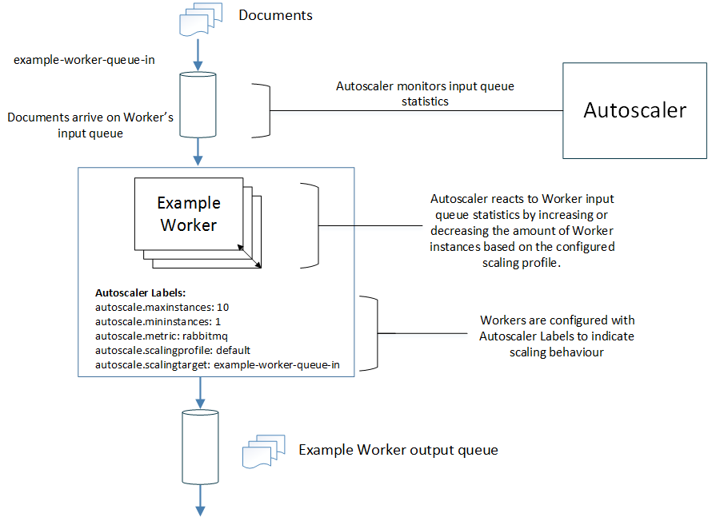

# Quick Start

## Introduction

The Autoscaler service provides on-demand scaling of services, allowing you to efficiently dedicate resources where they are needed most, and minimizing costs and ensuring user satisfaction. 

## Deployment Repository

This repository provides the necessary files to easily get started using the Autoscaler Service.

### Prerequisites

- Docker must be available on the system
- Docker Swarm must be enabled
- Services that are to be governed should be deployed on the same stack as the Autoscaler Service.

The deployment files are written in [Docker Compose v3](https://docs.docker.com/compose/compose-file/) format and is compatible with Docker Stack.

## Demonstration

The Autoscaler functions as follows (note the Worker in the diagram is an example to show how the Autoscaler manipulates other services):



The pipes represent asynchronous message queues on RabbitMQ.


1. **Autoscaler Service**
	
	The Autoscaler service monitors Worker input queues and scales Worker's up and down according to their workloads. The Autoscaler tracks the input and workload of specified Worker queues and calculates whether a Worker should be scaled up or down based on Labels provided within the Workers. The Labels set within each service to be tracked contain information such as the maximum and minimum amount of instances and the type of metric to be used. The Autoscaler can keep track of multiple microservices asyncronously depending on the performance specs of the host machine.

2. **Example Worker**

	This is an example generic worker which takes in documents as input, performs an operation on the documents and generates an output. The Worker has Autoscaler Labels defined, which describe how the Autoscaler should function in regards to the Worker.

## Usage

For demonstration purposes the [Job Service quick-start compose file](https://github.com/JobService/job-service/blob/v2.1.0/docker-compose.yml) will be used to show how the Autoscaler service can be integrated. 

The link above shows the Docker Compose file containing the microservices that make up the Job Service, however it lacks the Autoscaler service. The [Docker Compose file](./docker-compose.yml) within this quick-start directory shows the Job Service compose file as before, but with the Autoscaler Service added in and the required labels supplied.

Check the differences between the two files. Note the **Autoscaler Service** has been added into the compose file. Services which are to be governed also have the **Autoscaler Labels** supplied.

```
autoscaler:
    env_file:
      - ./rabbitmq.env
    environment:
      DOCKER_HOST: ${DOCKER_HOST:-<DOCKER_HOST_HERE_PLEASE_SET>}
      CAF_AUTOSCALER_DOCKER_SWARM_STACK: ${CAF_AUTOSCALER_DOCKER_SWARM_STACK:-autoscalerdemo}
    image: autoscaler/autoscale-dockerswarm-rabbit:1.1.0
	ports:
      - "${AUTOSCALER_PORT:-9981}:8081"
```

For the download, configuration and deployment of the Autoscaler Service follow the instructions below.

<br></br>

1. **Download the deployment files**
	
	Download the files from the repository. You can clone this repository using Git or download the files in a tar.gz file from [here](https://github.com/Autoscaler/autoscaler/releases).

2. **Configuration**

	Configure the external parameters if required. These properties can be set by updating the Docker Compose file and adding them into the Autoscaler Service environment. You are required to set your Docker Host and Stack name in order for Autoscaler to function correctly. If no values are configured for the optional parameters, the default values will be used. The following may be set:

	<table>
      <tr>
        <th>Environment Variable</th>
        <th>Default</th>
        <th>Description</th>
		<th>Required?</th>
      </tr>
      <tr>
        <td>DOCKER_HOST</td>
        <td>DOCKER_HOST_HERE_PLEASE_SET</td>
        <td>Used to specify the Docker Swarm REST endpoint. Note: You must set this before deploying the swarm in order for the Autoscaler to function e.g. http://machine:2375</td>
		<td>&#10004</td>
      </tr>
	  <tr>
        <td>CAF_RABBITMQ_HOST</td>
        <td>rabbitmq</td>
        <td>Used to specify the RabbitMQ Management API Endpoint. e.g http://rabbitmq:15672</td>
		<td>&#10006</td>
      </tr>
	  <tr>
        <td>CAF_RABBITMQ_PORT</td>
        <td>5672</td>
        <td>Used to specify the RabbitMQ Management API Endpoint. e.g http://rabbitmq:15672</td>
		<td>&#10006</td>
      </tr>
	  <tr>
        <td>CAF_RABBITMQ_USERNAME</td>
        <td>guest</td>
        <td>Used to specify the username used to connect to RabbitMQ.</td>
		<td>&#10006</td>
      </tr>
	  <tr>
        <td>CAF_RABBITMQ_PASSWORD</td>
        <td>guest</td>
        <td>Used to specify the password used to connect to RabbitMQ.</td>
		<td>&#10006</td>
      </tr>
	  <tr>
        <td>CAF_AUTOSCALER_MAXIMUM_INSTANCES</td>
        <td>100</td>
        <td>Used to specify the maximum number of instances that any worker can be scaled to.</td>
		<td>&#10006</td>
      </tr>
	  <tr>
		<td>CAF_AUTOSCALER_DOCKER_SWARM_STACK</td>
		<td><i>unspecified</i></td>
		<td>Used to identify the stack within which the Autoscaler will monitor. Note: You must set this in order for the Autoscaler to function. e.g. autoscalerdemo</td>
		<td>&#10004</td>
	  <tr>
        <td>CAF_DOCKER_SWARM_TIMEOUT</td>
        <td>30</td>
        <td>Used to specify the max length of time in seconds that a docker REST call can take before a timeout out occurs.</td>
		<td>&#10006</td>
      </tr>
	  <tr>
        <td>CAF_DOCKER_SWARM_HEALTHCHECK_TIMEOUT</td>
        <td>5</td>
        <td>Used to specify the max length of time in seconds that the Docker endpoint healthcheck can take before a timeout occurs.</td>
		<td>&#10006</td>
      </tr>
	  <tr>
        <td>AUTOSCALER_PORT</td>
        <td>9981</td>
        <td>This is the port the Autoscaler Service is configured to listen on. This can be used to run a healthcheck request on the Autoscaler.</td>
		<td>&#10006</td>
      </tr>
    </table> 

3. **Set the service labels**

	For each of the services to scale its docker-compose template must be updated to include labels such as the following example:

	```
   		labels:
      		- autoscale.metric=rabbitmq
      		- autoscale.scalingtarget=autoscale-monitor-in
      		- autoscale.scalingprofile=default
      		- autoscale.maxinstances=4
      		- autoscale.mininstances=1
      		- autoscale.interval=30
      		- autoscale.backoff=10
	```

	The `autoscale.metric` should always be `rabbitmq` for this container. Set the `autoscale.interval` to something sensible given your service workload. If you set this to a very small value (very frequent) then you will get very unstable scaling - the number of instances will rapidly increase and decrease seemingly with no cause. if you set this very large (infrequent) then the scaling will lag behind the demand significantly. Thus, containers which rapidly consume messages can have a lower interval. For containers that consume messages very slowly (whereby the average is tens of minutes or hours) this algorithm may not be suitable for your workloads and you may wish to consider writing a `workload` module more suited to your needs and make a container with it in.

	The `autoscale.scalingtarget` should be the RabbitMQ queue name to monitor. Set `autoscale.maxinstances` and `autoscale.mininstances` as your quality of service and resources dictate. The `autoscale.backoff` is the number of intervals to skip monitoring after a scale up or down command is issued. This prevents unusual values being considered when the system is in an unstable state.

	Deploy/redeploy the services and the autoscale container. After one or two minutes the autoscale container should find the services and start monitoring.

	##### Example

	Some workers in the autoscalerdemo already have these labels specified. You can see the labels set under some of the components, for example with worker-langdetect.

	```
    	labels:
      	- autoscale.metric=rabbitmq
      	- autoscale.scalingtarget=languageidentification-in
      	- autoscale.scalingprofile=default
      	- autoscale.maxinstances=4
      	- autoscale.mininstances=1
      	- autoscale.interval=30
      	- autoscale.backoff=10
	```


4. **Deploy the services**
 
 	Navigate to the folder where you have downloaded the files to and issue the following command to deploy the services through Docker Stack. Each service provided in the compose file will be deployed to the same stack. The Autoscaler needs to be on the same stack in order to monitor other services. In the command below the stack name is `autoscalerdemo`

	<table>
      <tr>
        <td><b>Docker Stack</b></td>
        <td>docker stack deploy --compose-file=docker-compose.yml autoscalerdemo</td>
      </tr>
    </table>

	##### Example

	Running this command with the docker-compose.yml file supplied will bring up the autoscalerdemo. This consists of the Job Service microservices, workers which can be scaled and the Autoscaler Service.

## Testing the Autoscaler

#### Healthcheck

The autoscale-core application inherently exposes standard and module-specific health checks. If you expose the admin port (default 8081) then this can be accessed via HTTP to examine metrics and health checks. The health check REST call will return HTTP 500 if any health check fails.

Run the following CURL command

`http://<DOCKER_HOST>:9981/healthcheck`

Replace `<DOCKER_HOST>` with the name of your own Docker Host and adjust the port if you are not using the default. You can adjust the port by setting the `AUTOSCALER_PORT` environment variable.

#### File Testing

With the Job Service deployed you can test if the Autoscaler is running correctly by supplying some files in the input directory and observing the services scaling up and down.

The Input directory can be configured through an environment variable, otherwise it will be set to its default value.

`- ${JOB_SERVICE_DEMO_INPUT_DIR:-./input-files}:/mnt/caf-worker-input-dir:ro`

For further information on what how to submit work to the Job Service, refer to the [Worker-Globfilter repository](https://github.com/JobService/worker-globfilter/blob/v2.1.0/README.md).

## Rabbit.env

Note in the compose file that many of the services depend on the environment file, **Rabbit.env**.

This file holds environment information relating to the RabbitMQ management service. Having the information held at a single location where each microservice can depend on allows for easy configuration where changes will be applied across all services in one go.

## Override Files
Docker Compose supports the concept of Override Files which can be used to modify the service definitions in the main Docker Compose files, or to add extra service definitions.

The following override files are supplied alongside the main Docker Compose file for the service:

<table>
  <tr>
    <th>Override File</th>
    <th>Description</th>
  </tr>
  <tr>
    <td>docker&#8209;compose.debug.yml</td>
    <td>This override file can be used by developers to help with debugging. It increases the logging levels, puts the services into a mode where a Java debugger can be attached to them, and exposes endpoints which are not normally exposed outside of the internal network.<p>
    <p>        
    The following additional endpoints are exposed to the external network:<p>
    <ol>
      <li>Job Service Database Connection Port</li>
      <li>RabbitMQ UI Port</li>
      <li>Java Debugging Port for all Workers</li>
      <li>Admin / HealthCheck Port for all Workers</li>
    </ol>
    <p>
    The override file itself can be examined to check which ports these internal ports are exposed on. The external ports are not used for the normal operation of the services so they can be safely modified if they clash with any other services running on the host.</td>
  </tr>
  <tr>
    <td>docker&#8209;compose&#8209;with&#8209;httpproxy.yml</td>
    <td>This override file can be used when the Autoscaler is running behind a proxy.
  </tr>
</table>

Use the -f switch to apply override files. For example, to start the services with the docker-compose.debug.yml file applied run the following command:

    docker-compose -f docker-compose.yml -f docker-compose.debug.yml up


### Using Autoscaler with a Proxy

An override file, `docker-compose-with-httpproxy.yml` is supplied for using Autoscaler behind a proxy. If required, this file should be deployed with the following environment variables set:

<table>
	  <tr>
        <th>Environment Variable</th>
        <th>Default</th>
        <th>Description</th>
		<th>Example</th>
      </tr>
      <tr>
        <td>HTTP_PROXY</td>
        <td><b>No Default</b></td>
        <td>Used to specify an HTTP based proxy, which is used during the Docker REST endpoint communication.</td>
		<td>http://proxy.somewebservice.net:8080</td>
      </tr>
	  <tr>
        <td>HTTPS_PROXY</td>
        <td><b>No Default</b></td>
        <td>Used to specify an HTTPS based proxy, which is used during the Docker REST endpoint communication.</td>
		<td>https://proxy.somewebservice.net:8080</td>
      </tr>
	  <tr>
        <td>NO_PROXY</td>
        <td><b>No Default</b></td>
        <td>Used to specify an ignore list for HTTP based proxy communication.</td>
		<td>192.168.59.103</td>
      </tr>
</table>